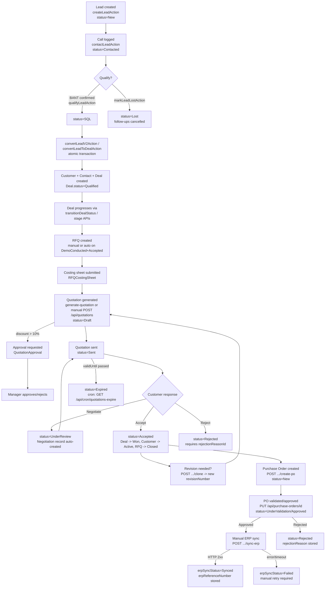

# Suki CRM — Lead-to-ERP Flow Overview

> **Scope**: This documentation traces the actual, code-verified path a record takes from
> Lead creation through to ERP synchronization in the Suki CRM codebase. It was produced by
> reading the Prisma schema (`prisma/schema.prisma`), server actions (`app/actions/*.ts`),
> API route handlers (`app/api/**/route.ts`), library services (`lib/*.ts`), and cron job
> handlers (`app/api/cron/**/route.ts`).
>
> Every non-trivial claim carries a `source:` reference so it can be spot-checked. Anything
> that could not be confirmed in code is flagged **"not found in code — needs confirmation."**

## How to read this

- **01-lead-generation.md** — how a Lead record is created and where it lands.
- **02-lead-qualification-and-follow-up.md** — how a Lead is contacted, scored, qualified (BANT/SQL), or marked Lost, and how follow-up tasks are generated/escalated.
- **03-deal-and-negotiation.md** — how a Lead becomes a Deal ("Opportunity"), the pipeline stage machine, and the Negotiation entity.
- **04-quotation.md** — how Quotations are generated (manual or from RFQ costing), sent, approved, accepted/rejected, revised (cloned), and expired.
- **05-purchase-order-and-agreement.md** — how a Purchase Order is generated from an Accepted Quotation, and its own approval/validation workflow.
- **06-fulfillment-and-erp-sync.md** — the manual "push to ERP" endpoint, payload shape, and success/failure handling.

## One-paragraph summary per phase

**Lead generation** — A Lead is created via `createLeadAction` in `app/actions/leads.ts`, either manually from the `/leads` page or through `POST /api/leads/import` (bulk import) or `POST /api/leads` (external/API entry). Every new Lead starts at `status = "New"`, gets a generated `leadCode` (`LD-YYYY-NNNNN`), a computed `leadScore`, a 15-minute SLA response deadline, and an auto-created first follow-up call task for the next business day. *Source: `app/actions/leads.ts:281-443`.*

**Lead qualification and follow-up** — A Sales Executive logs a call via `contactLeadAction`, which is the only path that moves a Lead from `New` → `Contacted` (guarded by a mandatory call log). From there, `qualifyLeadAction` promotes a Lead to `status = "SQL"` once a BANT checklist (Budget, Authority, Need, Timeline) is fully confirmed, or `markLeadLostAction` sets `status = "Lost"` with a required `lossReasonId`. Follow-ups are swept by `checkAndUpdateOverdueFollowUps()` (`app/actions/followUps.ts`), which marks passed-due follow-ups `Overdue` and escalates to `escalationLevel = 1` after 48 hours. *Source: `app/actions/leads.ts:747-1408`, `app/actions/followUps.ts:34-154`.*

**Deal and negotiation** — A Lead is converted into a Deal ("Opportunity") + Customer ("Account") + Contact atomically, either via the legacy `convertLeadToDealAction` or the V2 `convertLeadV2Action` (both in `app/actions/leads.ts`). The resulting Deal starts at `status = "Qualified"`. All further Deal status changes should flow through `transitionDealStatus()` in `lib/dealService.ts`, which records `DealStageHistory`, enforces a Manager/Admin gate on backward stage moves, and blocks the `Won` transition unless an `Accepted` Quotation exists for the deal. A `Negotiation` record is separately created automatically when a Quotation is pushed into `UnderReview` via `POST /api/quotations/[id]/negotiate`. **Important caveat**: the codebase contains two different Deal status vocabularies for the same `Deal.status` field (`Qualified/RequirementGathering/MeetingScheduled/DemoConducted/Rejected/Lost` from `lib/workflow-config.ts`'s `PIPELINE_WORKFLOW`, vs. `Active/OnHold/Won/Lost` from `DEALS_WORKFLOW`), and different code paths write different values into the same field — see the discrepancy note in `03-deal-and-negotiation.md`. *Source: `app/actions/leads.ts:1121-1618`, `lib/dealService.ts:1-313`, `lib/workflow-config.ts:31-63`.*

**Quotation** — A Quotation can be created directly (`POST /api/quotations`, manual line items), or generated from an RFQ's submitted costing sheet (`POST /api/rfq/[id]/generate-quotation`), which also flips the RFQ to `status = "QuotationCreated"`. It starts at `status = "Draft"`. If `discountPercent > 10%`, sending is blocked (`POST /api/quotations/[id]/send`) until a Sales Manager resolves an approval request (`POST .../request-approval`, `PUT .../approval`). Once `Sent`, it can move to `UnderReview` (negotiation), `Accepted` (cascades: Deal → `Won`, Customer Prospect → `Active`, RFQ → `Closed`), `Rejected` (requires a reason), or auto-`Expired` by the `GET /api/cron/quotations-expire` job. Revisions are made via `POST /api/quotations/[id]/clone`, which snapshots the old revision and increments `revisionNumber`. *Source: `app/api/quotations/route.ts`, `app/api/quotations/[id]/send|accept|reject|negotiate|clone|request-approval|approval/route.ts`.*

**Purchase order and agreement** — A Purchase Order is only creatable from a Quotation that is `status = "Accepted"`, via `POST /api/quotations/[id]/create-po`, which copies line items, customer, and terms and starts the PO at `status = "New"`. A separate `POST /api/quotations/[id]/create-deal` can create a Deal from an Accepted Quotation if one doesn't already exist (starting the Deal at `status = "Active"` — using the *other* status vocabulary noted above). PO status (`New → UnderValidation → Approved → Rejected/Closed`) is edited via `PUT /api/purchase-orders/[id]`; moving to `Approved` is blocked for non-Admin/SalesManager roles and blocked entirely if a pending `ApprovalHistory` record exists for that PO ("must resolve through Approval Center"). *Source: `app/api/quotations/[id]/create-po/route.ts`, `app/api/quotations/[id]/create-deal/route.ts`, `app/api/purchase-orders/[id]/route.ts`.*

**Fulfillment and ERP sync** — There is **no automatic ERP sync trigger** found in the code (no cron job, webhook, or status-change hook pushes to ERP). The only mechanism is a manual, user-initiated action: `POST /api/purchase-orders/[id]/sync-erp`, which requires the PO to be `status = "Approved"`, builds a JSON payload (PO + customer + contact + line items + totals), and POSTs it to `${SUKI_ERP_API_URL}/purchase-orders` with a bearer token from `SUKI_ERP_API_KEY`. On success it stores `erpSyncStatus = "Synced"`, `erpReferenceNumber`, `erpSyncedAt`, and the raw `erpResponse`. On failure/timeout (30s) it stores `erpSyncStatus = "Failed"` with the error in `erpResponse`; there is no automatic retry — a user must call the endpoint again. *Source: `app/api/purchase-orders/[id]/sync-erp/route.ts:1-222`.*

## End-to-end flow diagram

## Cross-cutting findings worth flagging

- **No scheduler config found in the repo** for the `app/api/cron/*` routes (no `vercel.json`, no GitHub Actions cron workflow). These are plain Next.js route handlers; something external must be calling them on a schedule — **not found in code — needs confirmation** of the actual invocation frequency for `quotations-expire`, `rfq-autoclose`, `tasks-overdue`, `nightly-batch`, `visits-auto-checkout`, `visits-missed`, `subscriptions`, `update-target-achievements`, `proposals`.
- A separate, standalone `node-cron` process exists at `scripts/email-scheduler.ts` with explicit schedules (`0 8 * * *` daily overdue-follow-up email summary, `*/30 * * * *` visit auto-checkout) — but this only runs if that script is executed as its own long-running process; nothing in the Next.js app boots it automatically. *Source: `scripts/email-scheduler.ts:117-127`.*
- **Two Deal status vocabularies share one `Deal.status` string field** — see `03-deal-and-negotiation.md` for the full breakdown of which code path writes which vocabulary.
- **ERP sync is entirely manual** — no status change, approval, or cron job triggers it automatically. See `06-fulfillment-and-erp-sync.md`.
