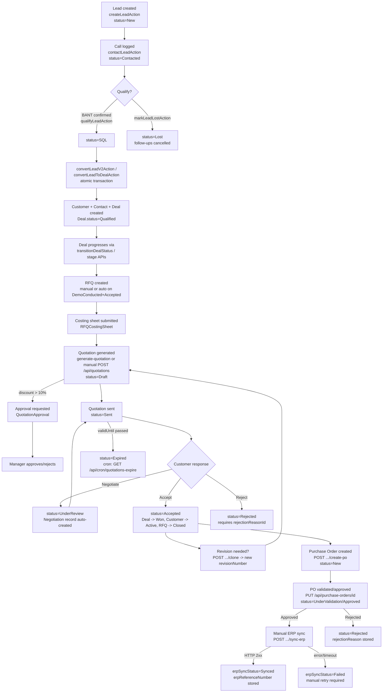

# Suki CRM — Lead-to-ERP Flow (Complete, Single-File Reference)

> **Scope**: This documentation traces the actual, code-verified path a record takes from
> Lead creation through to ERP synchronization in the Suki CRM codebase. It was produced by
> reading the Prisma schema (`prisma/schema.prisma`), server actions (`app/actions/*.ts`),
> API route handlers (`app/api/**/route.ts`), library services (`lib/*.ts`), and cron job
> handlers (`app/api/cron/**/route.ts`).
>
> Every non-trivial claim carries a `source:` reference so it can be spot-checked. Anything
> that could not be confirmed in code is flagged **"not found in code — needs confirmation."**
>
> This single file consolidates the same content originally split across `00-overview.md` and
> `01-lead-generation.md` through `06-fulfillment-and-erp-sync.md` in this directory.

---

## Table of contents

1. [Overview & end-to-end flow diagram](#1-overview--end-to-end-flow-diagram)
2. [Phase 1 — Lead Generation](#2-phase-1--lead-generation)
3. [Phase 2 — Lead Qualification & Follow-Up](#3-phase-2--lead-qualification--follow-up)
4. [Phase 3 — Deal (Opportunity) & Negotiation](#4-phase-3--deal-opportunity--negotiation)
5. [Phase 4 — Quotation](#5-phase-4--quotation)
6. [Phase 5 — Purchase Order & Agreement](#6-phase-5--purchase-order--agreement)
7. [Phase 6 — Fulfillment & ERP Sync](#7-phase-6--fulfillment--erp-sync)

---

## 1. Overview & end-to-end flow diagram

### One-paragraph summary per phase

**Lead generation** — A Lead is created via `createLeadAction` in `app/actions/leads.ts`, either manually from the `/leads` page or through `POST /api/leads/import` (bulk import) or `POST /api/leads` (external/API entry). Every new Lead starts at `status = "New"`, gets a generated `leadCode` (`LD-YYYY-NNNNN`), a computed `leadScore`, a 15-minute SLA response deadline, and an auto-created first follow-up call task for the next business day. *Source: `app/actions/leads.ts:281-443`.*

**Lead qualification and follow-up** — A Sales Executive logs a call via `contactLeadAction`, which is the only path that moves a Lead from `New` → `Contacted` (guarded by a mandatory call log). From there, `qualifyLeadAction` promotes a Lead to `status = "SQL"` once a BANT checklist (Budget, Authority, Need, Timeline) is fully confirmed, or `markLeadLostAction` sets `status = "Lost"` with a required `lossReasonId`. Follow-ups are swept by `checkAndUpdateOverdueFollowUps()` (`app/actions/followUps.ts`), which marks passed-due follow-ups `Overdue` and escalates to `escalationLevel = 1` after 48 hours. *Source: `app/actions/leads.ts:747-1408`, `app/actions/followUps.ts:34-154`.*

**Deal and negotiation** — A Lead is converted into a Deal ("Opportunity") + Customer ("Account") + Contact atomically, either via the legacy `convertLeadToDealAction` or the V2 `convertLeadV2Action` (both in `app/actions/leads.ts`). The resulting Deal starts at `status = "Qualified"`. All further Deal status changes should flow through `transitionDealStatus()` in `lib/dealService.ts`, which records `DealStageHistory`, enforces a Manager/Admin gate on backward stage moves, and blocks the `Won` transition unless an `Accepted` Quotation exists for the deal. A `Negotiation` record is separately created automatically when a Quotation is pushed into `UnderReview` via `POST /api/quotations/[id]/negotiate`. **Important caveat**: the codebase contains two different Deal status vocabularies for the same `Deal.status` field (`Qualified/RequirementGathering/MeetingScheduled/DemoConducted/Rejected/Lost` from `lib/workflow-config.ts`'s `PIPELINE_WORKFLOW`, vs. `Active/OnHold/Won/Lost` from `DEALS_WORKFLOW`), and different code paths write different values into the same field — see [§4](#4-phase-3--deal-opportunity--negotiation). *Source: `app/actions/leads.ts:1121-1618`, `lib/dealService.ts:1-313`, `lib/workflow-config.ts:31-63`.*

**Quotation** — A Quotation can be created directly (`POST /api/quotations`, manual line items), or generated from an RFQ's submitted costing sheet (`POST /api/rfq/[id]/generate-quotation`), which also flips the RFQ to `status = "QuotationCreated"`. It starts at `status = "Draft"`. If `discountPercent > 10%`, sending is blocked (`POST /api/quotations/[id]/send`) until a Sales Manager resolves an approval request (`POST .../request-approval`, `PUT .../approval`). Once `Sent`, it can move to `UnderReview` (negotiation), `Accepted` (cascades: Deal → `Won`, Customer Prospect → `Active`, RFQ → `Closed`), `Rejected` (requires a reason), or auto-`Expired` by the `GET /api/cron/quotations-expire` job. Revisions are made via `POST /api/quotations/[id]/clone`, which snapshots the old revision and increments `revisionNumber`. *Source: `app/api/quotations/route.ts`, `app/api/quotations/[id]/send|accept|reject|negotiate|clone|request-approval|approval/route.ts`.*

**Purchase order and agreement** — A Purchase Order is only creatable from a Quotation that is `status = "Accepted"`, via `POST /api/quotations/[id]/create-po`, which copies line items, customer, and terms and starts the PO at `status = "New"`. A separate `POST /api/quotations/[id]/create-deal` can create a Deal from an Accepted Quotation if one doesn't already exist (starting the Deal at `status = "Active"` — using the *other* status vocabulary noted above). PO status (`New → UnderValidation → Approved → Rejected/Closed`) is edited via `PUT /api/purchase-orders/[id]`; moving to `Approved` is blocked for non-Admin/SalesManager roles and blocked entirely if a pending `ApprovalHistory` record exists for that PO ("must resolve through Approval Center"). *Source: `app/api/quotations/[id]/create-po/route.ts`, `app/api/quotations/[id]/create-deal/route.ts`, `app/api/purchase-orders/[id]/route.ts`.*

**Fulfillment and ERP sync** — There is **no automatic ERP sync trigger** found in the code (no cron job, webhook, or status-change hook pushes to ERP). The only mechanism is a manual, user-initiated action: `POST /api/purchase-orders/[id]/sync-erp`, which requires the PO to be `status = "Approved"`, builds a JSON payload (PO + customer + contact + line items + totals), and POSTs it to `${SUKI_ERP_API_URL}/purchase-orders` with a bearer token from `SUKI_ERP_API_KEY`. On success it stores `erpSyncStatus = "Synced"`, `erpReferenceNumber`, `erpSyncedAt`, and the raw `erpResponse`. On failure/timeout (30s) it stores `erpSyncStatus = "Failed"` with the error in `erpResponse`; there is no automatic retry — a user must call the endpoint again. *Source: `app/api/purchase-orders/[id]/sync-erp/route.ts:1-222`.*

### End-to-end flow diagram



### Cross-cutting findings worth flagging

- **No scheduler config found in the repo** for the `app/api/cron/*` routes (no `vercel.json`, no GitHub Actions cron workflow). These are plain Next.js route handlers; something external must be calling them on a schedule — **not found in code — needs confirmation** of the actual invocation frequency for `quotations-expire`, `rfq-autoclose`, `tasks-overdue`, `nightly-batch`, `visits-auto-checkout`, `visits-missed`, `subscriptions`, `update-target-achievements`, `proposals`.
- A separate, standalone `node-cron` process exists at `scripts/email-scheduler.ts` with explicit schedules (`0 8 * * *` daily overdue-follow-up email summary, `*/30 * * * *` visit auto-checkout) — but this only runs if that script is executed as its own long-running process; nothing in the Next.js app boots it automatically. *Source: `scripts/email-scheduler.ts:117-127`.*
- **Two Deal status vocabularies share one `Deal.status` string field** — see [§4](#4-phase-3--deal-opportunity--negotiation) for the full breakdown of which code path writes which vocabulary.
- **ERP sync is entirely manual** — no status change, approval, or cron job triggers it automatically. See [§7](#7-phase-6--fulfillment--erp-sync).

---

## 2. Phase 1 — Lead Generation

### Entry points

There are **three** distinct code paths that create a `Lead` record. They are not unified —
each has its own validation, own defaults, and (in two of the three) its own lead-code format.

#### 1. Manual entry from the CRM UI
- **UI**: `/leads` page (`app/(dashboard)/leads/page.tsx`) — "New Lead" form/modal calls the server action.
- **Server action**: `createLeadAction()` in `app/actions/leads.ts:281-443`.
- Requires an authenticated, non-`Customer` user (`verifyAuth()` check). *Source: `app/actions/leads.ts:296-299`.*

#### 2. Inbound API / website form submission
- **Route**: `POST /api/leads` — `app/api/leads/route.ts:6-260`.
- Protected by an API key header (`x-api-key`), checked against `SystemConfig` key `leads_api_key`, falling back to `process.env.LEADS_API_KEY`, and finally to the **hardcoded literal `"suki_secret_key_123"`** if neither is set. *Source: `app/api/leads/route.ts:12-17`.* This hardcoded fallback is a notable security concern worth flagging to the team, though out of scope to fix here (documentation-only task).
- Intended for external website/form integrations — no CRM session/user auth is required, only the API key.

#### 3. Bulk CSV/Excel import
- **Route**: `POST /api/leads/import` — `app/api/leads/import/route.ts:72-367`.
- Requires an authenticated `Admin` or `SalesManager` role (`app/api/leads/import/route.ts:76-78`).
- Accepts `.csv`, `.xlsx`, `.xls` with a user-supplied column-to-field `mapping`.
- Runs a Zod schema (`LeadImportRowSchema`) per row and validates `status`/`leadSource` against fixed allow-lists (`VALID_STATUSES`, `VALID_SOURCES`). *Source: `app/api/leads/import/route.ts:8-9, 11-30`.*
- Duplicate rows (matched by email or phone against existing non-deleted leads) are either merged (`duplicateAction=update`) or the **existing** lead is flagged `status = "Duplicate"` (`duplicateAction=skip`, the default) — the import does **not** create a second row for a duplicate.

### Required fields and validation

| Path | Required fields | Source |
|---|---|---|
| `createLeadAction` (manual) | `name`, `phone`, `email`, `city`, `companyName` (all trimmed, non-empty); `estimatedValue` must be `>= 0` if provided | `app/actions/leads.ts:308-327` |
| `POST /api/leads` (inbound) | `name` only; email/phone/city are optional | `app/api/leads/route.ts:23-25` |
| `POST /api/leads/import` (bulk) | `name` (Zod `min(1)`); `email` must be valid format if present | `app/api/leads/import/route.ts:11-14` |

**Duplicate detection**:
- `createLeadAction` blocks creation outright if a non-deleted Lead with the same `email` exists in the same `companyId`. *Source: `app/actions/leads.ts:330-337`.*
- `POST /api/leads` blocks on duplicate `email` **or** `phone` (`prisma.lead.findUnique`/`findFirst`), globally (no `companyId` filter is applied to this specific duplicate check). *Source: `app/api/leads/route.ts:33-51`.*
- Additionally, `createLeadAction` runs a secondary, **non-blocking** `detectDuplicates()` pass after creation (fire-and-forget, errors swallowed). *Source: `app/actions/leads.ts:432`.* The implementation of `detectDuplicates()` itself was not read in this pass — **not found in code — needs confirmation** of exactly what heuristic it applies beyond exact email/phone match.

### Default values on creation

All three paths set:
- `status = "New"`
- `slaStatus = "Pending"`
- `slaResponseDeadline` = now + 15 minutes (`createLeadAction`: `app/actions/leads.ts:353-354`; inbound API: `app/api/leads/route.ts:122-123`)
- `escalationLevel = 0`

Lead code formats differ by path:
- `createLeadAction`: `LD-YYYY-NNNNN` via `generateLeadCode()` (per-company sequential). *Source: `app/actions/leads.ts:340`.*
- `POST /api/leads` (inbound): `LEAD-W<5 random digits>`, retried up to 10 times for uniqueness, falling back to a timestamp suffix. *Source: `app/api/leads/route.ts:108-119`.*
- `POST /api/leads/import`: `LD-YYYY-NNNNN`, same generator pattern as manual creation but offset per batch position. *Source: `app/api/leads/import/route.ts:35-43`.*

`createLeadAction` additionally computes a `leadScore` (0-100) via `calculateLeadScore()` based on `industryType`, `leadSource`, `designation`, `estimatedValue`, presence of email/phone. *Source: `app/actions/leads.ts:342-350`.* The bulk import path leaves `leadScore = 0` for every imported row (no scoring is run). *Source: `app/api/leads/import/route.ts:269`.*

### What gets created/updated

| Table (Prisma model) | Written by |
|---|---|
| `Lead` | All 3 paths |
| `LeadStatusHistory` (initial `null → "New"` or `null → status`) | `createLeadAction` (`app/actions/leads.ts:382`), bulk import (`app/api/leads/import/route.ts:275-277`). The inbound `POST /api/leads` path does **not** write an initial `LeadStatusHistory` row — only `AuditLog`. |
| `LeadOwnerHistory` (initial assignment) | `createLeadAction` (`app/actions/leads.ts:385-393`), inbound API (`app/api/leads/route.ts:162-172`). Bulk import does not write `LeadOwnerHistory`. |
| `FollowUp` (auto-created, `type = "Call"`, next business day 9am, `sourceType = "AUTO"`) | Only `createLeadAction` (`app/actions/leads.ts:395-416`). The equivalent block in `POST /api/leads` is explicitly commented out (`// DISABLED: Only SLA countdown should show...`, `app/api/leads/route.ts:174-195`) — **inbound leads do not get an auto follow-up task.** |
| `CallLog` | Only inbound API, and only if a `message` was submitted with the enquiry (`app/api/leads/route.ts:198-207`). |
| `AuditLog` | All 3 paths. |
| `Notification` | `createLeadAction` and inbound API notify the assigned user and (for `createLeadAction`) managers via `dispatchNotification`/`dispatchNotificationsToMany`. |

### Assignment / routing logic

- `createLeadAction`: assigns to `assignedUserId` param if given, else to the creating user (self-assignment). *Source: `app/actions/leads.ts:365`.*
- `POST /api/leads` (inbound) implements **workload-based round robin**: reads `SystemConfig` keys `leads_assignment_mode` (`ROUND_ROBIN` default or `DEFAULT_POOL`) and `leads_default_assignee_id`. In round-robin mode, it queries all active `SalesExecutive` users, counts each one's currently `New`/`Contacted` leads, and assigns to whichever has the fewest (least-busy-first). Falls back to `SalesManager` role if no executives exist, then to any `Admin`. *Source: `app/api/leads/route.ts:53-106`.*
- Bulk import: only assigns if an `assignedToEmail` column was mapped and resolves to an active user in the same company; otherwise the row is imported unassigned. *Source: `app/api/leads/import/route.ts:220-229, 242`.*

### Where the lead lands / who can see it

- After creation, all paths link back to `/leads/{id}` in notifications, meaning the Lead Detail page is `app/(dashboard)/leads/[id]/page.tsx`.
- The list view is `app/(dashboard)/leads/page.tsx`.
- `createLeadAction` specifically links to `/leads/{id}?action=contact` in the assignment notification, which auto-opens the Call Log modal on the detail page for the first interaction. *Source: `app/actions/leads.ts:427`.*
- Visibility is governed by `checkRecordScope()` from `lib/scopes.ts` (row-level security) — the inbound API path and manual creation path both filter by `companyId` (multi-tenant), and `SalesExecutive` visibility is further scoped (see `app/api/rfq/route.ts:27` for an example of the same pattern applied elsewhere — the Lead-specific scope function itself is in `lib/scopes.ts`, not re-read line-by-line in this pass — **not found in code (exact rules) — needs confirmation** of the full row-level-security matrix per role for Leads specifically).

### Edge cases found in code

- **Hardcoded API key fallback** (`"suki_secret_key_123"`) in `POST /api/leads` if no `SystemConfig`/env value is configured — anyone with this literal string can create leads. *Source: `app/api/leads/route.ts:14`.*
- **Duplicate-by-phone check in `POST /api/leads` is not company-scoped** (`prisma.lead.findFirst({ where: { phone: normalizedPhone } })` has no `companyId` filter), unlike the email check pattern used elsewhere — in a multi-tenant deployment this could block a legitimate lead in Company B because a lead with the same phone exists in Company A. *Source: `app/api/leads/route.ts:43-51`.*
- **Auto follow-up task is disabled for inbound leads** (commented out), so an inbound Lead's *only* time pressure is the 15-minute SLA countdown, with no follow-up task appearing in the Follow-Ups module until someone manually creates one.
- **Bulk import duplicate handling mutates the *existing* lead's status to `"Duplicate"`**, not the incoming row — this could silently change the status of an active, in-progress lead if it happens to share an email/phone with an imported row, without a value judgement on whether the existing one is genuinely a duplicate.
- Import validates `status` against a hardcoded list that does **not** include `"Duplicate"` or `"Converted"` (`VALID_STATUSES = ["New","Contacted","FollowUpDue","SQL","Qualified","Lost"]`) — importing a row with `status="Converted"` would fail validation, even though `"Converted"` is a valid runtime status elsewhere in the code.

---

## 3. Phase 2 — Lead Qualification & Follow-Up

### Status values observed in code

The `Lead.status` field (`prisma/schema.prisma:754`, default `"New"`) is a free-text `String`,
not a Prisma enum. Observed values actually written by code:

`New` → `Contacted` → `SQL` → `Converted`, with `Lost` and `Duplicate` as side-exits.
(`lib/crm-pipeline.ts:3` separately types a `LeadStatus` union of `"New" | "Contacted" | "FollowUpDue" | "SQL" | "Qualified" | "Converted" | "Lost"` — note it lists `"Qualified"` as a distinct value from `"SQL"`, but no lead action in `app/actions/leads.ts` was found that sets `status = "Qualified"` on a Lead; `qualifyLeadAction` sets `"SQL"`. **Not found in code — needs confirmation** of whether `"Qualified"`/`"FollowUpDue"` are ever actually written to `Lead.status` anywhere outside `lib/crm-pipeline.ts`'s type declaration.)

### New → Contacted

- **Entry point**: User logs a call from the Lead Detail page (`/leads/{id}`), typically via the `?action=contact` auto-opened modal.
- **Action**: `contactLeadAction(leadId, callData)` — `app/actions/leads.ts:747-913`.
- **Gate**: only allowed when `lead.status === "New"` (returns an error otherwise); `callData.content` (call notes) is **mandatory** — "no silent status updates" is enforced by design. *Source: `app/actions/leads.ts:778-785`.*
- **What gets written**:
  - A `CommunicationLog` row (`channel: "Call"`) is created **first**.
  - Only after that succeeds is `Lead.status` set to `"Contacted"`, plus `lastInteractionAt = now`.
  - If this is the first response (`!lead.firstRespondedAt`), `slaStatus = "Met"` and `firstRespondedAt = now` are also set — i.e., the 15-minute SLA clock is satisfied by this action. *Source: `app/actions/leads.ts:826-834`.*
  - The auto-created `FollowUp` (from Phase 1, `type: "Call"`, `sourceType: "AUTO"`) is marked `status: "Completed"`. *Source: `app/actions/leads.ts:838-850`.*
- **Notifications**: assigned user + all `Admin`/`SalesManager` in the same company. *Source: `app/actions/leads.ts:873-899`.*
- **Edge case**: if `lead.status !== "New"` the action fails outright with a message — there is no path to log a *second* call through this specific action; later calls presumably go through a different generic activity-logging action (not traced in this pass — **not found in code — needs confirmation**).

### Qualification: BANT → SQL

- **Entry point**: BANT checklist form on the Lead Detail page.
- **Action**: `qualifyLeadAction(leadId, { hasBudget, hasAuthority, hasNeed, timelineMonths })` — `app/actions/leads.ts:1281-1343`.
- **Business rule**: `hasBudget && hasAuthority && hasNeed` must all be `true`, and `timelineMonths > 0`, or the action returns a validation error without touching the record. *Source: `app/actions/leads.ts:1291-1296`.*
- **Edge case — no status guard**: unlike `contactLeadAction`, this action does **not** check the Lead's current `status` before transitioning — it can be called on a Lead in `"New"`, `"Contacted"`, or any other non-terminal state, and will still force `status = "SQL"`. There is no enforcement that a Lead must be `"Contacted"` first.
- **What gets written**: `status = "SQL"`, `budgetAsked` and `timelineAsked` overwritten with derived text, `isGenuine = hasNeed`; a `LeadStatusHistory` row; notification to all `Admin`/`SalesManager`.

### Mark Lost

- **Action**: `markLeadLostAction(leadId, lossReasonId, notes?)` — `app/actions/leads.ts:1349-1408`.
- **Required**: `lossReasonId` referencing a `LossReason` record — action fails without it. *Source: `app/actions/leads.ts:1356-1358`.*
- **Cascading effect**: all `Pending` `FollowUp` rows for that lead are bulk-updated to `status: "Cancelled"`. *Source: `app/actions/leads.ts:1382-1386`.*
- Writes `Lead.status = "Lost"`, `lostReason` (text), `lostReasonRefId`; a `LeadStatusHistory` row; notifies the assigned user.
- No lower-bound status check exists here either — a Lead in any status can be marked Lost.

### Follow-up creation, reminders, and escalation

- **Creation on lead creation**: covered in Phase 1 — only `createLeadAction` auto-creates the first `FollowUp` (`type: "Call"`, next business day 9am).
- **Manual creation**: `createFollowUpAction()` — `app/actions/followUps.ts:263-379` (used broadly across modules, not lead-specific).
- **Overdue sweep + escalation**: `checkAndUpdateOverdueFollowUps(companyId?)` — `app/actions/followUps.ts:34-154`.
  - Finds `Pending` follow-ups whose `nextMeetingDate` has passed → sets `status = "Overdue"`.
  - Of those, if `nextMeetingDate` is more than **48 hours** in the past, also sets `escalationLevel = 1` immediately.
  - Separately re-scans existing `Overdue` follow-ups still at `escalationLevel = 0` whose `nextMeetingDate` is >48h past, and escalates them too.
  - On escalation: writes an `AuditLog` (`module: "follow-up"`, `action: "escalate"`) and notifies all `Admin`/`SalesManager` in the company via `dispatchNotificationsToMany`. *Source: `app/actions/followUps.ts:96-153`.*
- **Trigger for this sweep function — not a dedicated cron route**: `checkAndUpdateOverdueFollowUps` is called from `app/actions/visits.ts`, `app/api/reports/followups/route.ts`, and the standalone script `scripts/email-scheduler.ts` (see below) — i.e. it appears to run **on-demand** whenever those code paths execute (e.g., when a user loads the Follow-Ups report), not on a fixed schedule inside the Next.js app itself. **Not found in code — needs confirmation** of whether there is additionally a dedicated `/api/cron/*` route for this (no `app/api/cron/follow-ups*` directory exists in the repo).
- **Standalone scheduled process**: `scripts/email-scheduler.ts` uses `node-cron` and explicitly schedules:
  - `cron.schedule("0 8 * * *", sendOverdueSummaries)` — daily at 8:00 AM, calls `checkAndUpdateOverdueFollowUps()` then emails a summary of `Overdue` follow-ups to each assigned user via `nodemailer`. *Source: `scripts/email-scheduler.ts:17-22, 120-122`.*
  - `cron.schedule("*/30 * * * *", runVisitsAutoCheckout)` — every 30 minutes.
  - This script is **not** part of the Next.js request lifecycle — it must be run as its own long-lived Node process (e.g. `node scripts/email-scheduler.ts` or a PM2/systemd unit). **Not found in code — needs confirmation** of how/whether this script is actually started in the deployed environment.
- **Rescheduling**: `rescheduleFollowUpAction()` resets `escalationLevel = 0` if the new date is in the future (`app/actions/followUps.ts:840`), otherwise leaves status as `"Overdue"`.

### Scoring / routing recap (from Phase 1, restated for completeness)

- Lead scoring (`calculateLeadScore`) only runs at manual creation via `createLeadAction`; it is not re-computed as qualification data changes (e.g. `qualifyLeadAction` does not recompute `leadScore` even though it collects budget/timeline/need signals).
- Routing/assignment logic is one-time at creation (Phase 1); no reassignment/round-robin re-balancing was found triggered by qualification events. A manual `reassignFollowUpAction` exists (`app/actions/followUps.ts:865-938`) for follow-ups specifically, but not for the Lead's `assignedUserId` itself outside of `LeadOwnerHistory`-tracked manual reassignment (not traced further in this pass).

### Edge cases

- A Lead can jump straight from `"New"` to `"SQL"` (skipping `"Contacted"`) because `qualifyLeadAction` has no status precondition.
- A Lead already `"Converted"` can still be run through `qualifyLeadAction` or `markLeadLostAction` — neither of those two actions checks for `status === "Converted"` (only the convert actions themselves guard against double-conversion; see Phase 3).
- Follow-ups belonging to a Lost lead are cancelled, but follow-ups already `Completed` are left untouched (only `Pending` ones are bulk-cancelled).

---

## 4. Phase 3 — Deal (Opportunity) & Negotiation

### Lead → Deal conversion

Three separate atomic-transaction actions exist in `app/actions/leads.ts` that turn a Lead into
a Customer + Deal. They are not the same code path and produce slightly different records:

| Action | Lines | Creates | Deal starting status |
|---|---|---|---|
| `convertLeadToCustomerAction` | `1015-1116` | Customer only (no Deal) | n/a |
| `convertLeadToDealAction` (legacy/V1) | `1121-1271` | Customer (if not already converted) + Contact + Deal + `OpportunityDetail` | `"Qualified"` |
| `convertLeadV2Action` (V2, atomic) | `1414-1618` | Customer ("Account") + Contact + Deal ("Opportunity") + `OpportunityDetail`, with GSTIN validation and code generation | `"Qualified"`, `opportunityCode = OPP-YYYY-NNNNN` |

Both `convertLeadToDealAction` and `convertLeadV2Action` guard against double-conversion by
checking `lead.status === "Converted"` first (`app/actions/leads.ts:1140, 1446`), then run the
whole creation inside `prisma.$transaction`, then set `Lead.status = "Converted"` and populate
`convertedAccountId` / `convertedOpportunityId` on the Lead, plus a `LeadStatusHistory` row.
*Source: `app/actions/leads.ts:1552-1571` (V2 example).*

`convertLeadV2Action` additionally re-links existing `MarketingVisit`, `FollowUp`, `CallLog`,
`CommunicationLog` rows from the Lead to the new Customer inside the same transaction.

**Edge case**: Neither conversion action requires `lead.status === "SQL"` first — a Lead can be
converted directly from `"New"` if a user has the UI access to trigger it. There is no code-level
gate tying conversion eligibility to the BANT qualification step from Phase 2.

### The Deal status field has two different vocabularies

This is the single most important structural finding in this phase. `Deal.status`
(`prisma/schema.prisma:547`, a plain `String`, default `"Qualified"`) is written to by **two
functionally distinct sets of values**, both documented explicitly in `lib/module-status-config.ts`
as operating on the same field:

- **"Pipeline" module** (`lib/module-status-config.ts:32-34,216-223`): comment states *"Backend:
  Deal.status field, values from PipelineStageMaster + Lost"*, surfaced at `/sales-pipeline/pipeline-list`
  via `GET /api/opportunities?stage=`. Canonical values from `PIPELINE_STAGE_VALUES`
  (`lib/module-status-config.ts:41-48`): `Qualified, RequirementGathering, MeetingScheduled,
  DemoConducted, Rejected, Lost`.
- **"Deals" module** (`lib/module-status-config.ts:110-117, 224+`): comment states *"Backend:
  Deal.status field"*, surfaced via `/api/deals` (`getDealsAction`). Values from `DEALS_STATUS`:
  `Active, OnHold, Won, Lost`.

Concretely, different code paths write different vocabularies into the same field:
- `updateDealStatusAction` (`app/actions/deals.ts:446-517`) normalizes the target status through
  `normalizeStage()` from `lib/module-status-config.ts`, which **only accepts** the Pipeline
  vocabulary (`Qualified/RequirementGathering/MeetingScheduled/DemoConducted/Rejected/Lost`) —
  passing `"Active"` or `"Won"` here would fail normalization and return "Invalid stage" (`app/actions/deals.ts:493-495`).
- `POST /api/quotations/[id]/create-deal` (`app/api/quotations/[id]/create-deal/route.ts:59`)
  creates a brand-new Deal directly with `status: "Active"` — a value from the *Deals* vocabulary,
  bypassing `normalizeStage`/`transitionDealStatus` entirely (it uses a raw `tx.deal.create`, not
  `transitionDealStatus`).
- `lib/dealService.ts`'s `transitionDealStatus()` — the "centralized" state machine meant to be
  the single gateway for all transitions — itself references both vocabularies: it looks up
  `PipelineStageMaster` for stage ordering (Pipeline vocabulary) but also explicitly special-cases
  `toStatus === "Won"` (Deals vocabulary) for the accepted-quotation gate and customer-activation
  logic. *Source: `lib/dealService.ts:84-118, 192-216`.*
- `POST /api/quotations/[id]/accept` (`app/api/quotations/[id]/accept/route.ts:56-71`) sets a
  linked Deal directly to `status: "Won"` via a raw `tx.deal.update`, again bypassing
  `transitionDealStatus()`.

**Net effect**: a Deal's `status` can end up holding a Pipeline-vocabulary value
(e.g. `"DemoConducted"`) or a Deals-vocabulary value (e.g. `"Active"`, `"Won"`) depending on which
code path last touched it, and the two module UIs filter on mutually exclusive value sets — a
Deal moved to `"Active"` by the create-deal-from-quotation flow would not appear under any
Pipeline-module stage filter, and vice versa. This matches a previously logged product bug
(P10 in the existing bug ledger: *"Divergent stage vocabularies; deals defaults to Active bypassing
funnel"*). **This is a real, code-confirmed inconsistency, not a guess.**

### The pipeline stage machine (`transitionDealStatus`)

All transitions that go through `lib/dealService.ts:transitionDealStatus()` (called from
`updateDealStatusAction`, and from cron/system code) get:
- A `DealStageHistory` row (`fromStatus`, `toStatus`, `durationInPreviousStage` in days, a JSON `stageDataSnapshot`). *Source: `lib/dealService.ts:65-137`.*
- **Backward-stage gate**: if the target stage's `displayOrder` (from `PipelineStageMaster`) is
  lower than the current stage's, only `SalesManager`, `Admin`, or `SuperAdmin` may proceed —
  otherwise it throws `"Stage rollback requires Manager approval"`. *Source: `lib/dealService.ts:95-104`.*
- **Won gate**: transitioning to `"Won"` throws unless an `Accepted`, non-deleted `Quotation`
  exists with `dealId` pointing at this deal. *Source: `lib/dealService.ts:106-118`.*
- **RFQ auto-creation**: transitioning to `"DemoConducted"` with `deal.demoOutcome === "Accepted"`
  (a structured field set by the stage-change API/UI) auto-creates an `RFQ` (`rfqCode: RFQ-YYYY-NNNNN`,
  `status: "New"`) linked via `opportunityId`, if one doesn't already exist for that deal.
  *Source: `lib/dealService.ts:139-190`.*
- **Customer status sync**: on `Won`, the linked `Customer.status` is set to `"ActiveCustomer"`
  with an `AccountStatusHistory` row; if a Deal is reverted away from `Won` and the customer has
  no other `Won` deals or active `Subscription`s, the customer is reverted to `"Prospect"`.
  *Source: `lib/dealService.ts:192-262`.*
- **Notifications**: assigned user (if different from actor), and all `Admin`/`SalesManager` if
  `dealValue > 500000`. *Source: `lib/dealService.ts:272-299`.*

### Stage-entry validation (`updateDealStatusAction`)

Before calling `transitionDealStatus`, `updateDealStatusAction` (`app/actions/deals.ts:446-517`)
runs BRD-specific field-completeness checks (explicitly commented "BRD Variant 1 only"):
- Entering `"MeetingScheduled"` requires `OpportunityDetail.meetingDate`, `meetingType`,
  `meetingStatus` to already be filled. *Source: `app/actions/deals.ts:477-481`.*
- Entering `"ProposalSent"` requires `OpportunityDetail.proposedSolution`. *Source: `app/actions/deals.ts:482-486`.*
- No pre-validation is enforced for entering `"Negotiation"` (comment explicitly notes negotiation
  detail fields are filled *after* entering the stage). *Source: `app/actions/deals.ts:487-488`.*

### Negotiation entity

A `Negotiation` record is **not** created when a Deal enters a "Negotiation"-ish stage directly —
it is auto-created as a side effect of a **Quotation** transition:
- **Trigger**: `POST /api/quotations/[id]/negotiate` — moves the Quotation to `status: "UnderReview"`.
- If the quotation has a linked `dealId` and that deal isn't already `Negotiation`/`Won`/`Lost`,
  the deal is force-set to `status: "Negotiation"` via a raw `tx.deal.update` (again bypassing
  `transitionDealStatus`). *Source: `app/api/quotations/[id]/negotiate/route.ts:48-69`.*
- A `Negotiation` row is created (or reused if one already exists for that `quotationId`):
  `negotiationCode: NEG-NNNN`, `initialAmount` = quotation's `finalAmount`/`totalAmount`,
  `status: "Active"`, `assignedUserId` copied from the deal. *Source: `app/api/quotations/[id]/negotiate/route.ts:78-101`.*
- Negotiation's own status machine (`PUT /api/negotiations/[id]`, `app/api/negotiations/[id]/route.ts:6, 40-132`)
  has valid values `["Active", "PriceRevision", "CommercialDiscussion", "PendingApproval", "Won", "Lost"]`
  — a **third**, again distinct, vocabulary from either Deal vocabulary. Transitioning *out of*
  `"PendingApproval"` is blocked until the linked approval is resolved in the Approval Center.
  *Source: `app/api/negotiations/[id]/route.ts:65-70`.*
- `SalesRep` role can only modify negotiations assigned to them (`app/api/negotiations/[id]/route.ts:57-59`).
- Setting status to `"Won"`/`"Lost"` sets `outcome` and `closedAt`; no automatic cascade back to
  the Deal or Quotation status was found in this handler — **not found in code — needs
  confirmation** of whether closing a Negotiation as Won/Lost is expected to also update the
  linked Deal/Quotation (it does not appear to, based on this file alone).

### Who can advance/reject a deal

- `updateDealStatusAction`: `Admin`, `SalesManager`, `SalesExecutive` (`app/actions/deals.ts:449`).
- Backward stage moves inside `transitionDealStatus`: `SalesManager`/`Admin`/`SuperAdmin` only.
- `deleteDealAction` (soft-delete for most; hard-delete only for `SuperAdmin`): `Admin`/`SuperAdmin` (`app/actions/deals.ts:519-563`).
- Negotiation edits: any non-`Customer` role, with `SalesRep` restricted to their own assigned records.

### Discount approval on a Deal

`requestDiscountAction` / `resolveDiscountAction` / `createDiscountApprovalAction` exist in
`app/actions/deals.ts` (lines `602-999`) for deal-level discount approval, writing to
`Deal.discountPercent`, `discountStatus`, `discountApprovedById`, and `ApprovalHistory`. These
were located but not read line-by-line in this pass — **not found in code (full business rules) —
needs confirmation** of the exact discount-threshold and approver-role rules for this specific
action (as distinct from the Quotation-level 10% threshold documented in Phase 4, which *was*
confirmed in code).

### Edge cases

- A rolled-back ("Lost" → reopened) Deal is explicitly supported: `reversible: true` in
  `lib/workflow-config.ts`'s `PIPELINE_WORKFLOW`/`DEALS_WORKFLOW` configs, and `dealService.ts`
  has no blanket block on transitioning away from `Lost`.
- A Deal can be forced to `"Won"` by the Quotation-accept cascade (`POST /api/quotations/[id]/accept`)
  **without** passing through `transitionDealStatus`'s Won-gate check — meaning the "must have an
  Accepted quotation" rule is trivially satisfied in that path (since it's *triggered by* that
  quotation's acceptance) but the deal update itself skips `DealStageHistory` recording, audit
  logging via `logAudit("Deal", ...)`, and the high-value-deal manager notification that
  `transitionDealStatus` would otherwise produce.

---

## 5. Phase 4 — Quotation

### Entry points

#### 1. Manual quotation
- **Route**: `POST /api/quotations` — `app/api/quotations/route.ts:40-216`.
- **UI**: `/quotations` list page + create form (`app/(dashboard)/quotations/`).
- Requires a non-`Customer` authenticated user. Requires `customerId`, a `validUntil` date that
  is not in the past, and at least 1 line item (either passed directly in `body.items`, or — if
  `rfqId` is provided and no items were passed — copied from that RFQ's `lineItems` using the
  latest submitted `computedUnitPrice`). *Source: `app/api/quotations/route.ts:47-99`.*
- All totals (`subtotal`, `taxAmount`, `discountAmount`, `finalAmount`/grand total) are
  **server-computed** from line items, never trusted from the client. *Source: `app/api/quotations/route.ts:101-133`.*
- Code format: `QT-YYYY-NNNNN` (per-company, per-year sequence). Starts at `status: "Draft"`,
  `revisionNumber: 1`. A `QuotationStatusHistory` row (`null → "Draft"`) is written in the same
  transaction. *Source: `app/api/quotations/route.ts:135-193`.*

#### 2. Generated from an RFQ's costing sheet
- **RFQ flow leading up to this**: RFQ created (`POST /api/rfq`, `status: "New"`) → assigned to a
  costing owner (`POST /api/rfq/[id]/assign-costing`, requires ≥1 line item, sets
  `status: "CostingPending"`, restricted to non-`Customer` roles) → Costing Engineer/Admin submits
  a costing sheet (`POST /api/rfq/[id]/costing-sheet`, restricted to `CostingEngineer`/`Admin`
  roles; computes `unitPrice = (material+labour+freight+packaging+tooling+other) × (1+overhead%) × (1+margin%)`,
  rejects `computedUnitPrice <= 0`). *Source: `app/api/rfq/[id]/assign-costing/route.ts:11-52`, `app/api/rfq/[id]/costing-sheet/route.ts:55-178`.*
- **Route**: `POST /api/rfq/[id]/generate-quotation` — `app/api/rfq/[id]/generate-quotation/route.ts:7-193`.
- **Gate**: fails if the RFQ has zero submitted costing sheets. *Source: `app/api/rfq/[id]/generate-quotation/route.ts:29-35`.*
- Builds quotation line items from `RFQLineItem`s, resolving each item's unit price from its
  matching per-line-item costing sheet, falling back to an RFQ-level costing sheet (one with no
  `rfqLineItemId`) if present. Tax percent is looked up from `TaxMaster` by matching
  `product.productCode` against `TaxMaster.hsnCode` (default `18%` if no match). *Source: `app/api/rfq/[id]/generate-quotation/route.ts:86-124`.*
- On success, the RFQ is moved to `status: "QuotationCreated"` with an `RFQStatusHistory` row, in
  the same transaction as the quotation creation. Validity is set to **30 days** from generation.
  *Source: `app/api/rfq/[id]/generate-quotation/route.ts:60-62, 139-153`.*
- Notifies the RFQ's assigned user and (if present) its contact.

### Approval flow (discount-gated)

- **Threshold**: hardcoded `discountThreshold = 10` (10%) inside `POST /api/quotations/[id]/send`.
  *Source: `app/api/quotations/[id]/send/route.ts:44`.*
- If `quotation.discountPercent > 10` and there is no `QuotationApproval` row with
  `status === "Approved"`, sending is blocked with HTTP 402 and `requires_approval: true`.
  *Source: `app/api/quotations/[id]/send/route.ts:45-54`.*
- **Requesting approval**: `POST /api/quotations/[id]/request-approval` — only from `status: "Draft"`;
  defaults the approver to any active `SalesManager` in the same company if none is specified;
  blocks if a `Pending` approval already exists for the quotation. *Source: `app/api/quotations/[id]/request-approval/route.ts:22-45`.*
- **Deciding**: `PUT /api/quotations/[id]/approval` — restricted to `SalesManager`, `Admin`,
  `SuperAdmin` (SuperAdmin additionally must be in "support mode"); resolves the most recent
  `Pending` `QuotationApproval` row to `Approved`/`Rejected`, notifies the requester.
  *Source: `app/api/quotations/[id]/approval/route.ts:6-19, 28-77`.*
- **What happens on rejection**: only the `QuotationApproval.status` becomes `"Rejected"` and the
  requester is notified — the Quotation itself stays at `"Draft"`. There is no automatic re-route
  or escalation on rejection found in this handler.

### Status machine observed in code

`Draft → Sent → UnderReview ⇄ Sent → Accepted | Rejected | Expired`

| Transition | Endpoint | Gate | Side effects |
|---|---|---|---|
| `Draft → Sent` | `POST /api/quotations/[id]/send` | Must be `Draft`; ≥1 item; `validUntil >= today`; discount ≤10% or approved | Creates a `FollowUp` (Call, +2 days); notifies creator. *Source: `app/api/quotations/[id]/send/route.ts:26-100`.* |
| `Sent`/`UnderReview → UnderReview` | `POST /api/quotations/[id]/negotiate` | Must be `Sent` or already `UnderReview` | Moves linked Deal to `"Negotiation"` (if not `Won`/`Lost`); auto-creates/reuses a `Negotiation` record. See §4. |
| `Sent`/`UnderReview → Accepted` | `POST /api/quotations/[id]/accept` | Must be `Sent` or `UnderReview` | Cascades: linked Deal → `"Won"`; Customer `Prospect` → `Active`; linked RFQ → `"Closed"`; cancels the customer's `Pending`/`Overdue` follow-ups (only if `dealId` set); notifies `SalesManager`s ("Deal Won!"), the creator, and `Admin`/`CostingEngineer` ("New Order"). *Source: `app/api/quotations/[id]/accept/route.ts:25-172`.* |
| `Sent`/`UnderReview → Rejected` | `POST /api/quotations/[id]/reject` | Must be `Sent` or `UnderReview`; `rejectionReasonId` required | No cascade to Deal/RFQ. |
| `Sent`/`UnderReview → Expired` | `GET /api/cron/quotations-expire` | `validUntil < now` | Notifies creator; also separately notifies creators of quotations expiring within 7 days (deduped to once per 24h). *Source: `app/api/cron/quotations-expire/route.ts:1-87`.* No dedicated schedule config found in the repo for this route — **not found in code — needs confirmation** of actual invocation frequency. |

### Versioning / revisions

- **`POST /api/quotations/[id]/clone`** (`app/api/quotations/[id]/clone/route.ts:6-145`) is the
  revision mechanism: snapshots the current quotation + items into `QuotationRevisionSnapshot.snapshotJson`,
  then creates a **new** `Quotation` row with a **new** `quotationCode` (`QT-YYYY-NNNNN`),
  `revisionNumber: existing.revisionNumber + 1`, `status: "Draft"`, validity reset to 30 days from
  now, copying customer/deal/RFQ links and all line items. The original quotation is left
  untouched (its own status is not changed by cloning).
- A separate, simpler **`POST /api/quotations/[id]/duplicate`** endpoint also exists
  (`app/api/quotations/[id]/duplicate/route.ts:5-58`), which creates a new quotation with a
  **different** code format (`QUO-NNNN`, not `QT-YYYY-NNNNN`) and does **not** write a
  `QuotationRevisionSnapshot` or increment `revisionNumber`. Two separate "copy this quotation"
  code paths exist with different semantics and different code formats — **flagging this as a
  likely source of confusion**, since both are plausible "Duplicate" or "Revise" UI actions.

### Converting an Accepted Quotation onward

- **To a Purchase Order**: `POST /api/quotations/[id]/create-po` — only from `status: "Accepted"`;
  blocks if a PO already exists for this quotation; copies line items, customer, contact, deal,
  linked negotiation (if any), payment/delivery terms; starts the PO at `status: "New"`. See §6.
  *Source: `app/api/quotations/[id]/create-po/route.ts:9-153`.*
- **To a Deal** (if one doesn't already exist): `POST /api/quotations/[id]/create-deal` — only
  from `status: "Accepted"`; blocks if `quotation.dealId` is already set; creates the Deal at
  `status: "Active"` (Deals vocabulary — see §4's discrepancy note) and links it back via
  `quotation.dealId`. *Source: `app/api/quotations/[id]/create-deal/route.ts:9-81`.*

### What UI pages the user sees

- List/create: `/quotations` (`app/(dashboard)/quotations/page.tsx`).
- Detail: `/quotations/{id}` (`app/(dashboard)/quotations/[id]/`), linked from nearly every
  notification produced in this phase.
- PDF export exists at `GET /api/quotations/[id]/pdf` (listed in the API directory but not read
  in this pass — **not found in code (content) — needs confirmation** of PDF template/fields).

### Edge cases found in code

- Approval rejection does not block re-requesting approval again — `request-approval` only checks
  for a currently-`Pending` approval, not for a prior `Rejected` one, so a rejected quotation can
  have approval re-requested indefinitely.
- `negotiate` and `accept` both directly mutate `Deal.status` with raw `tx.deal.update` calls,
  bypassing `transitionDealStatus()` — so Deal-side audit logs, `DealStageHistory` entries, and
  high-value-deal manager notifications from `lib/dealService.ts` are **not** produced for
  Deal transitions caused by Quotation events.
- Two distinct "copy" endpoints (`clone` vs `duplicate`) with different code formats and revision
  tracking, as noted above.
- `create-deal` will silently produce a Deal `dealName` of the form `"{customer} — {quotationCode}"`
  regardless of any richer opportunity naming used elsewhere in the app.

---

## 6. Phase 5 — Purchase Order & Agreement

### Entry points

There are **two** ways a `PurchaseOrder` record is created:

#### 1. From an Accepted Quotation (primary path)
- **Route**: `POST /api/quotations/[id]/create-po` — `app/api/quotations/[id]/create-po/route.ts:9-153`.
- **Gate**: quotation must be `status === "Accepted"`; blocked if a PO already exists for that
  `quotationId` (returns the existing PO's id instead of creating a duplicate). *Source: lines 39-53.*
- **Restricted to**: `Admin`, `SalesManager`, `SalesExecutive` roles. *Source: line 17-19.*
- **Data copied automatically from the Quotation** (no manual re-entry required):
  - `customerId`, `contactId`, `dealId` — copied as-is.
  - `negotiationId` — looked up separately (`Negotiation.findFirst({ quotationId })`) and linked
    if one exists.
  - Line items — mapped 1:1 from `QuotationItem` → `PurchaseOrderItem` (`productId`, `description`,
    `quantity`, `unitPrice`, `totalPrice`).
  - `paymentTerms`, `deliveryTerms` — copied verbatim.
  - `billingAddress` — copied from `Customer.billingAddress`.
  - `discountPercent` — copied from the quotation; `totalAmount`/`finalAmount` recomputed from the
    copied items (not blindly copied from the quotation's totals).
- **Data that must be entered manually at this step** (not derivable from the quotation):
  - `expectedDelivery` (optional, from request body).
  - `assignedUserId` (defaults to the creating user if not provided).
  - `notes` (appended to an auto-generated note: `"Created from Quotation {code}. {notes}"`).
- PO code format: `PO-NNNN` (4-digit, per-company sequential — note this differs from the
  `QT-YYYY-NNNNN` / `LD-YYYY-NNNNN` year-prefixed formats used elsewhere). Starts at `status: "New"`.
  *Source: lines 61-108.*
- Notifies the assigned user (if different from creator) and all `Admin`/`SalesManager` in the company.

#### 2. Direct manual creation
- **Route**: `POST /api/purchase-orders` — `app/api/purchase-orders/route.ts:51-80+` (creation
  continues beyond the read window but requires `customerId` and ≥1 line item; same `PO-NNNN`
  code generator).
- Not gated on any Quotation or Deal state — a PO can exist with no upstream quotation at all.
- **Not found in code — needs confirmation** of whether this manual path is actually surfaced in
  the `/purchase-orders` UI or is only used internally/by API integrations — the presence of both
  a quotation-derived and a fully-manual creation path was confirmed, but which is the primary
  user-facing flow was not verified against the frontend component in this pass.

### What UI page(s) the user sees

- List: `/purchase-orders` (`app/(dashboard)/purchase-orders/page.tsx`).
- Detail: `/purchase-orders/{id}` (`app/(dashboard)/purchase-orders/[id]/page.tsx`) — this is
  where the "Sync to ERP" action lives (see §7), and where notifications from this phase link.

### Status machine

`VALID_STATUSES = ["New", "UnderValidation", "Approved", "Rejected", "Closed"]`
*Source: `app/api/purchase-orders/[id]/route.ts:7`.*

Edited via `PUT /api/purchase-orders/[id]` (`app/api/purchase-orders/[id]/route.ts:36-194`):

| Transition | Rule |
|---|---|
| Any → `Approved` (direct, not via existing `Approved`) | Only `Admin`/`SalesManager` may set this directly. If a `Pending` `ApprovalHistory` row already exists for `entityType: "PurchaseOrder"` + this PO's id, the direct update is **blocked** — "Resolve it in the Approval Center first." *Source: lines 61-74.* |
| Any → `Approved` (via Approval Center) | `POST /api/approvals` creates a generic `ApprovalHistory` row (`entityType`, `entityId`, `approvalType`, `status: "Pending"`); resolution happens through `app/api/approvals/[id]` (not read in this pass — **not found in code — needs confirmation** of the exact resolve endpoint's cascade back to `PurchaseOrder.status`). |
| → `Approved` (either path) | Sets `approvedById = user.id`, `approvedAt = now`, clears `rejectionReason`. |
| → `Rejected` | If `body.rejectionReason` provided, it is stored. |
| → `Closed` | If `actualDelivery` isn't already set, it is auto-set to `now`. |
| Line-item edits | If `body.items` array is provided, **all** existing `PurchaseOrderItem`s are deleted and replaced (`deleteMany: {} + create: newItems`), and totals are recomputed server-side. |

- **Row-level restriction**: `SalesRep` role can only modify a PO assigned to them
  (`existing.assignedUserId !== user.id` → 403). *Source: lines 52-55.*
- On any status change, the assigned user is notified. *Source: lines 182-191.*
- Soft-delete only (`deletedAt`/`deletedById`) — `DELETE /api/purchase-orders/[id]` never hard-deletes.

### Signature / approval steps

- No electronic-signature capture code (e.g. signature pad, DocuSign-style integration) was found
  for the PO itself. The schema has `poDocumentUrl` (a stored file URL) and `validationChecklist`
  (a free-text field) on `PurchaseOrder`, suggesting the "signature" step is a manual
  upload-a-signed-PDF workflow rather than an in-app e-signature flow. **Not found in code —
  needs confirmation** of what UI writes to `poDocumentUrl`/`validationChecklist` and whether any
  external e-signature service is integrated (no such integration code was found in `app/api` or `lib`).
- Approval is role-gated (Admin/SalesManager, or via the generic Approval Center) as described above,
  but this is a status-field approval, not a document-signature approval.

### Linking a Deal to a PO (alternate branch)

`POST /api/quotations/[id]/create-deal` (covered in §5) can create a Deal from an Accepted
Quotation independently of PO creation — a Deal and a PO can both trace back to the same
Quotation via `quotation.dealId`/`purchaseOrder.quotationId`, but neither creation of one forces
creation of the other.

### Edge cases found in code

- Creating a PO from an already-PO'd Quotation returns the **existing** PO's id rather than
  erroring silently or creating a duplicate — this is a deliberate idempotency guard.
- A PO's `negotiationId` link is opportunistic (`findFirst` by `quotationId`) — if multiple
  Negotiation records ever exist for the same quotation (the `negotiate` endpoint in §5 only
  prevents duplicates when quotationId matches exactly), the PO would link to whichever one the
  `findFirst` query happens to return first (no explicit ordering was specified in the query).
- Manual PO creation (`POST /api/purchase-orders`) has none of the "copy from quotation" guards —
  a manually-created PO's `quotationId`/`dealId`/`negotiationId` fields would be null unless
  explicitly passed in the request body, meaning it would not appear correctly cross-linked in the
  Quotation or Deal detail views' "related records" sections.
- `PUT /api/purchase-orders/[id]` allows recomputing totals from a fresh `items` array at the same
  time as a status change in a single request — there is no lock preventing someone from both
  changing the line items *and* approving the PO in one call, which could let a PO be approved
  with items that were never separately reviewed at the new prices.

---

## 7. Phase 6 — Fulfillment & ERP Sync

### What triggers the sync — manual only

There is exactly **one** ERP integration point in the entire codebase:

- **Route**: `POST /api/purchase-orders/[id]/sync-erp` — `app/api/purchase-orders/[id]/sync-erp/route.ts:1-222` (the file's own header comment explicitly describes this).
- **Trigger**: a user action (a button, presumably on the PO detail page `/purchase-orders/{id}`, though the specific button component was not read in this pass — the route itself is the confirmed trigger).
- **There is no**:
  - Cron job that syncs POs to ERP (no `app/api/cron/*sync*` or `*erp*` route exists).
  - Webhook receiver for inbound ERP callbacks (no route under `app/api` matching an ERP webhook pattern was found).
  - Event listener / database trigger tied to a PO status change that fires the sync automatically.
  - **Not found in code — needs confirmation** that this is intentional (i.e., that ERP push is
    meant to be a manual, human-initiated action rather than automatic) — but based on the code
    that exists today, that is the only mechanism.

### Precondition

- The PO must be `status === "Approved"` — any other status returns HTTP 400 with
  `"Purchase order must be in 'Approved' status before syncing to ERP"`. *Source: lines 40-46.*
- The ERP integration must be configured via two environment variables:
  - `SUKI_ERP_API_URL`
  - `SUKI_ERP_API_KEY`
  If either is missing, the endpoint returns HTTP 500 with an explicit configuration error rather
  than attempting the call. *Source: lines 48-56.*
- **Role gate**: any authenticated user except `role === "Customer"` may trigger this. *Source: lines 23-25.*

### What data is sent to ERP

The endpoint builds a JSON payload (`erpPayload`) from the PO plus its related `customer`,
`contact`, and `items` (with each item's `product`), shaped as follows (exact field names from
`app/api/purchase-orders/[id]/sync-erp/route.ts:59-102`):

```json
{
  "source": "SUKI-CRM",
  "poCode": "<PurchaseOrder.poCode>",
  "poNumber": "<PurchaseOrder.poNumber>",
  "poDate": "<PurchaseOrder.poDate>",
  "expectedDelivery": "<PurchaseOrder.expectedDelivery>",
  "customer": {
    "code": "<Customer.customerCode>",
    "name": "<Customer.name>",
    "email": "<Customer.email>",
    "phone": "<Customer.phone>",
    "address": "<PurchaseOrder.shippingAddress OR Customer.city>",
    "city": "<Customer.city>"
  },
  "contact": { "name": "...", "email": "...", "phone": "..." } | null,
  "lineItems": [
    {
      "productSku": "<Product.productCode>",
      "productName": "<Product.name OR item.description>",
      "description": "<PurchaseOrderItem.description>",
      "quantity": "<PurchaseOrderItem.quantity>",
      "unitPrice": "<PurchaseOrderItem.unitPrice>",
      "totalPrice": "<PurchaseOrderItem.totalPrice>",
      "unit": "<Product.unit>"
    }
  ],
  "totals": {
    "totalAmount": "<PurchaseOrder.totalAmount>",
    "discountPercent": "<PurchaseOrder.discountPercent>",
    "finalAmount": "<PurchaseOrder.finalAmount>"
  },
  "paymentTerms": "<PurchaseOrder.paymentTerms>",
  "deliveryTerms": "<PurchaseOrder.deliveryTerms>",
  "shippingAddress": "<PurchaseOrder.shippingAddress>",
  "billingAddress": "<PurchaseOrder.billingAddress>",
  "specialInstructions": "<PurchaseOrder.specialInstructions>",
  "notes": "<PurchaseOrder.notes>",
  "syncedAt": "<ISO timestamp, generated at send time>",
  "syncedBy": { "id": "<User.id>", "email": "<User.email>" }
}
```

- **Request**: `POST {SUKI_ERP_API_URL}/purchase-orders`, headers `Content-Type: application/json`,
  `Authorization: Bearer {SUKI_ERP_API_KEY}`, `X-Source: SUKI-CRM`. *Source: lines 116-125.*
- **Timeout**: 30 seconds, enforced via `AbortController`. *Source: line 114.*

### What comes back / how it's handled

1. **Before the call**: the PO is immediately set to `erpSyncStatus: "Pending"` and the outgoing
   payload is persisted to `PurchaseOrder.erpPayload` (as a JSON string), *before* the network
   call is made. *Source: lines 106-111.*
2. **On HTTP success (`erpResponse.ok`)**:
   - A reference number is extracted from the ERP's JSON response by trying, in order:
     `referenceNumber`, `erpReference`, `poReference`, `id`, `documentNumber` (first non-null wins;
     `null` if none of these keys are present). *Source: lines 139-145.*
   - `PurchaseOrder` is updated: `erpSyncStatus: "Synced"`, `erpReferenceNumber`, `erpSyncedAt: now`,
     `erpResponse` (the full raw JSON response, stringified).
   - An `AuditLog` entry (`module: "PurchaseOrder"`, `action: "ERPSync"`) is written.
   - Response to the CRM UI: `{ success: true, data: <updated PO>, message: "Successfully synced to ERP. Reference: {ref}" }`.
3. **On HTTP error status (ERP responded but not 2xx)**:
   - `erpSyncStatus: "Failed"`, `erpResponse` stores `{ status, body }` from the ERP's response.
   - `AuditLog` entry (`action: "ERPSyncFailed"`).
   - CRM UI receives HTTP 502 with `{ success: false, message: "ERP returned status {status}", error: <responseJson> }`.
4. **On network error / timeout**:
   - Same `erpSyncStatus: "Failed"` handling; `erpResponse` stores `{ error, type }` (where `type`
     is `"AbortError"` for a timeout, giving the message *"ERP request timed out (30s)"*).
   - CRM UI receives HTTP 502 with the error message.

### What the user sees in the CRM UI

- On success: the PO record now carries `erpSyncStatus: "Synced"` and `erpReferenceNumber` —
  the PO detail page presumably renders this (not confirmed in this pass since the frontend
  component for `/purchase-orders/[id]` was not read line-by-line — **not found in code (UI
  rendering) — needs confirmation** of exactly how the status/reference/retry button are displayed).
- On failure: `erpSyncStatus: "Failed"` is persisted, and the raw error is stored in `erpResponse`
  for later inspection — but the endpoint itself does not schedule or perform any automatic retry.
- **Retry**: because the route is idempotent by design (it can be called again on the same PO
  regardless of the previous `erpSyncStatus`, as long as the PO is still `"Approved"`), a user
  can manually re-trigger the sync by calling the endpoint again (presumably via a "Retry" button
  on the PO detail page). No backoff, rate-limiting, or retry-count field exists on `PurchaseOrder`
  to distinguish a first attempt from a retry.

### Edge cases found in code

- If the PO's status changes away from `"Approved"` after a prior failed sync (e.g. someone
  re-opens it via `PUT /api/purchase-orders/[id]` with `status: "UnderValidation"`), a retry would
  be blocked by the same `status !== "Approved"` guard — the user would need to re-approve the PO
  before retrying the ERP push.
- The reference-number extraction tries five different possible key names from the ERP's response
  — if the actual ERP integration uses a different key, `erpReferenceNumber` will silently be
  `null` even on a successful (`erpResponse.ok`) sync, and the UI message falls back to
  `"Successfully synced to ERP."` with no reference shown.
- `erpPayload` and `erpResponse` are both stored as raw JSON strings (`@db.NVarChar(Max)`) rather
  than structured/relational data — there is no `ERPSyncLog` history table, so only the **most
  recent** sync attempt's payload/response is retained per PO; a second sync attempt overwrites
  the first attempt's `erpPayload`/`erpResponse`, with only the `AuditLog` trail (`ERPSync`/`ERPSyncFailed`
  entries) preserving prior attempts (and only as a text summary, not the payload itself).
- No `Deal`, `Quotation`, `Negotiation`, or `Customer` field is updated as a result of a successful
  ERP sync — the sync's effect is scoped entirely to the `PurchaseOrder` row. **Not found in
  code — needs confirmation** of whether the customer/product/inventory data should also be
  expected to sync to ERP (e.g. for stock fulfillment tracking) — no such code exists today.
- There is no dedicated ERP "connection test" or health-check endpoint — configuration errors
  (missing env vars) only surface at the moment a real sync is attempted.
